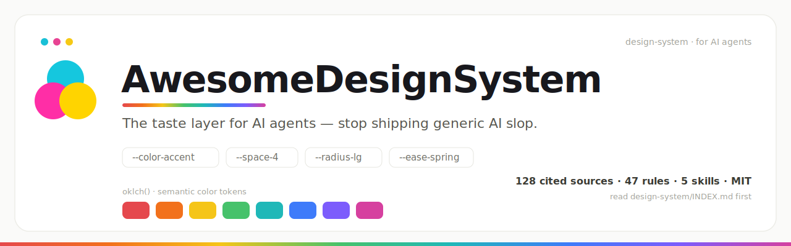

<div align="center">



&nbsp;

[](./LICENSE)
[](./content/references)
[](./content/canon)
[](./packages/react)
[](#-las-cinco-skills)
[](#-inicio-rápido)
[](./CONTRIBUTING.md)

[English](./README.md) · [日本語](./README.ja.md) · [简体中文](./README.zh-Hans.md) · [한국어](./README.ko.md) · **Español**

</div>

---

> **Evita la mediana. Comprométete con un punto de vista.**  
> AwesomeDesignSystem ya no es solo “Markdown + skills”. Es una **plataforma de diseño para agentes de IA**: doctrina curada, grafo de evidencia versionado, tokens/componentes/motion ejecutables y un sitio de docs local bilingüe (EN/JA) — para que los agentes entreguen UI moderna (2026) con sensación humana, no “AI slop”.

## 🧭 Por qué existe

Pide a un LLM “haz un landing” y casi nunca obtienes *diseño*: obtienes la **mediana estadística** de cada tutorial de Tailwind. Inter, degradado púrpura-azul, hero centrado, tres tarjetas con emoji. El modelo cae al centro salvo que lo dirijas.

AwesomeDesignSystem dirige con **cuatro capas enlazadas**:

| Capa | Qué es | Dónde |
| --- | --- | --- |
| **Doctrine** | Conocimiento de diseño con código embebido | `design-system/` |
| **Evidence** | Fuentes primarias estructuradas + reglas canon | `content/` |
| **Executable** | Tokens, React base, motion, contratos de marca | `packages/` |
| **Verbs** | Skills de agente con divulgación progresiva | `skills/` + `install.sh` |

## 🎁 Qué obtienes

| Resultado | Cómo |
| --- | --- |
| **Dejar de enviar AI slop** | Principios de gusto, patrones anti-mediana, skill de review |
| **Trazar cada afirmación** | Reference Atlas → reglas canon → artifacts → tests |
| **UI accesible más rápido** | 32 componentes React con contratos + React Aria |
| **Motion con intención** | Recetas que respetan `prefers-reduced-motion` |
| **Marca como código** | Product Lexicon, voz y lint de copy |
| **Mantenerse actualizado** | Freshness, links y CI |
| **Explorar en local** | Docs Next.js en **EN/JA** (`/en/*`, `/ja/*`) |

Grafo actual (validado): **105 Reference Atlas · 42 reglas canon · 54 artifacts · 6 signals en cuarentena**.

## 📂 Qué hay dentro

```
design-system/     canon legible por humanos
content/           grafo máquina: references / canon / artifacts / signals
packages/          tokens · core · react · motion · brand · content
apps/docs/         docs Next.js 16 + Reference Atlas + previews
skills/            cinco skills portátiles
research/ · docs/ · scripts/
```

## 🛠️ Las cinco skills

|  | Skill | Para… |
| :-: | --- | --- |
| 🎨 | **/AwesomeDS** | Construir o refinar UI con la capa de gusto |
| 🏗️ | **/MakeAwesomeDS** | Generar el DS propio del producto |
| 📄 | **/AwesomeHTML** | Markdown → HTML de un solo archivo |
| 🔍 | **/AwesomeReview** | Auditar slop y fallos de a11y |
| ✨ | **/AwesomeMotion** | Motion con propósito |

## 🚀 Inicio rápido

### 1) Agente de IA — sin instalar

Lee primero [`DESIGN.md`](./DESIGN.md) y [`design-system/INDEX.md`](./design-system/INDEX.md); abre solo lo necesario; cita `rule.*` y traza a `ref.*`.

### 2) Skills de Claude Code

```bash
git clone https://github.com/Yu-aimaker/AwesomeDesignSystem.git
cd AwesomeDesignSystem
./install.sh
```

### 3) Monorepo local + sitio de docs

Requiere **Node ≥ 22.12** y **pnpm 10.5.2**.

```bash
pnpm install
pnpm --filter @awesome-ds/docs dev   # http://127.0.0.1:3000
pnpm validate && pnpm test && pnpm qa:core
```

Ver [`docs/architecture.md`](./docs/architecture.md) y [`docs/completion-audit.md`](./docs/completion-audit.md).

## 📐 El estándar en un aliento

> Evita la mediana. Un color dominante + acentos nítidos. Tipografía deliberada. Jerarquía real; un foco por pantalla. La contención es confianza. El motion comunica estado. Tematiza primitivos. Diseña error / vacío / carga. WCAG 2.2 AA. Un **todo** coherente.

## 🔬 Evidencia y frescura

- Reference Atlas, reglas canon, signals en cuarentena  
- `pnpm check:links` · `pnpm check:freshness` · `pnpm evidence:check`  
- **No es un listado de enlaces** — las fuentes se absorben en doctrina y contratos ejecutables, validados por el grafo.

## 🌐 Localización

UI de docs en inglés y japonés. El Markdown canon es inglés primero; el fallback se marca de forma explícita.

## 🤝 Contribuir · ⚖️ Licencia

[CONTRIBUTING.md](./CONTRIBUTING.md) · [MIT](./LICENSE)

<div align="center"><sub>Hecho para que la IA diseñe como si tuviera gusto. 🎨</sub></div>
