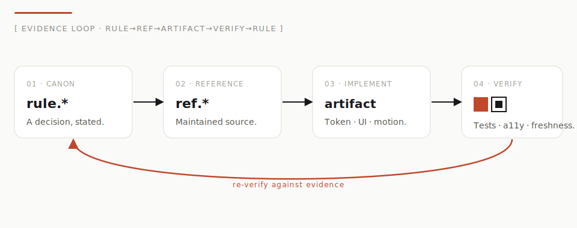
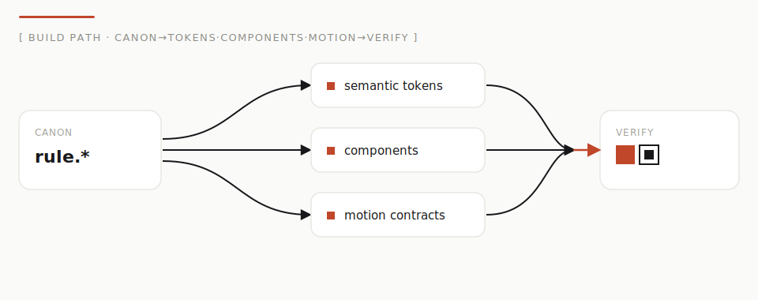

<div align="center">


&nbsp;

[](./LICENSE)
[](./content/references)
[](./content/canon)
[](./packages/react)
[](#다섯-스킬)
[](#빠른-시작)
[](./CONTRIBUTING.md)

[English](./README.md) · [日本語](./README.ja.md) · [简体中文](./README.zh-Hans.md) · **한국어** · [Español](./README.es.md)

</div>

---

> **증명할 수 있는 미감. 중앙값을 피하라.**
>
> AwesomeDesignSystem은 더 이상 “Markdown + 스킬”만이 아닙니다. 사람과 AI 에이전트를 위한 **증거 우선(evidence-first) 디자인 계기**입니다. 큐레이션된 교의, 버전 관리되는 증거 그래프, 실행 가능한 토큰/컴포넌트/모션, 영·일 이중 언어 문서 사이트 — 모든 선택이 “AI 슬롭”의 일반적 중앙값이 아니라 1차 출처까지 거슬러 올라갑니다.
>
> 네 개의 내비게이션 동사가 전부를 조직합니다: **Start**(체계와 원칙) · **Explore**(Reference Atlas, AI 가이드, 브랜드) · **Build**(기초·컴포넌트·모션·패턴·인터랙션) · **Verify**(리뷰·상태·플레이그라운드). 제작 루프는 **Start → Build → Verify**, **Explore**는 어느 단계에서나 열 수 있는 참조 레이어입니다.

## 그림으로 보는 시스템





## 존재 이유

LLM에게 “랜딩 페이지 만들어 줘”라고 하면 _디자인_ 대신 Tailwind 튜토리얼의 **통계적 중앙값**이 자주 나옵니다. Inter, 보라→파랑 그라데이션, 중앙 히어로, 이모지 카드 3장. 조타하지 않으면 중심으로 떨어집니다.

AwesomeDesignSystem은 **서로 연결된 4개 레이어**로 조타합니다.

| 레이어         | 내용                                      | 위치                     |
| -------------- | ----------------------------------------- | ------------------------ |
| **Doctrine**   | 코드가 박힌 의견 있는 디자인 지식         | `design-system/`         |
| **Evidence**   | 구조화·검증된 1차 출처와 canon 규칙       | `content/`               |
| **Executable** | 토큰, React 베이스라인, 모션, 브랜드 계약 | `packages/`              |
| **Verbs**      | 점진적 공개 에이전트 스킬                 | `skills/` + `install.sh` |

## 얻을 수 있는 것

| 결과                        | 방법                                                   |
| --------------------------- | ------------------------------------------------------ |
| **AI 슬롭 중단**            | 취향 원칙, 반-중앙값 패턴, 리뷰 스킬                   |
| **주장 추적**               | Reference Atlas → canon → artifact → 테스트            |
| **접근성 UI 가속**          | 공유 계약 + React Aria 32 컴포넌트                     |
| **의도 있는 모션**          | `prefers-reduced-motion` 준수 레시피                   |
| **브랜드 as code**          | Product Lexicon, 보이스 규칙, 카피 lint                |
| **신선도 유지**             | freshness / 링크 거버넌스 + CI                         |
| **Prove release readiness** | 보안, a11y, 성능 및 QA 게이트를 갖춘 공개 Reports 표면 |
| **로컬 탐색**               | Next.js 문서 (**EN/JA**, `/en/*` `/ja/*`)              |

현재 증거 그래프(검증됨): **128 Reference Atlas · 47 canon · 54 artifact · 6 quarantine signal**.

## 구성

```
design-system/     사람이 읽는 정전
content/           기계용 그래프
packages/          tokens · core · react · motion · brand · content
apps/docs/         로컬 Next.js 16 문서 + Reference Atlas + 라이브 프리뷰
skills/            다섯 개의 이식 가능 스킬
research/ · docs/ · reports/ · scripts/
```

## 다섯 스킬

|      | 스킬               | 용도                                    |
| :--: | ------------------ | --------------------------------------- |
| `01` | **/AwesomeDS**     | 취향 레이어로 UI 구축·다듬기            |
| `02` | **/MakeAwesomeDS** | 제품 고유 DS 생성 (OKLCH + `DESIGN.md`) |
| `03` | **/AwesomeHTML**   | Markdown → 단일 HTML                    |
| `04` | **/AwesomeReview** | AI 슬롭·a11y 감사                       |
| `05` | **/AwesomeMotion** | 목적 지향 모션                          |

## 빠른 시작

### 1) AI 에이전트 — 설치 불필요

[`DESIGN.md`](./DESIGN.md)와 [`design-system/INDEX.md`](./design-system/INDEX.md)를 먼저 읽고, 작업에 필요한 모듈만 엽니다. `rule.*`를 인용하고 `ref.*`까지 추적합니다.

### 2) Claude Code 스킬

```bash
git clone https://github.com/Yu-aimaker/AwesomeDesignSystem.git
cd AwesomeDesignSystem
./install.sh
```

### 3) 로컬 monorepo + 문서 사이트

**Node ≥ 22.13.0**, **pnpm 10.5.2** 필요.

```bash
pnpm install
pnpm --filter @awesome-ds/docs dev   # http://127.0.0.1:3000
pnpm validate && pnpm test && pnpm qa:core
```

자세한 내용: [`docs/architecture.md`](./docs/architecture.md), [`docs/completion-audit.md`](./docs/completion-audit.md).

공개 릴리스 증거: [`/reports`](https://awesome-design-system.yumaker.studio/en/reports) · 라이브 그래프/최신성: [`/status`](https://awesome-design-system.yumaker.studio/en/status)

## 한 호흡 표준

> 중앙값을 피하라. 관점을 가져라. 주조색 + 날카로운 액센트. 의도적 서체. 진짜 계층; 화면당 초점 하나. 절제 = 자신감. 모션은 상태를 전한다. 원시 기본값을 내지 마라. 에러/빈/로딩 상태를 설계하라. WCAG 2.2 AA. 일관된 전체.

## Design tokens — shared vocabulary

시맨틱 OKLCH 토큰, 멀티 테마, `@awesome-ds/tokens`를 통해 CSS / Tailwind 친화적으로 생성됨.

| 그룹       | 예시                                                                                                   |
| ---------- | ------------------------------------------------------------------------------------------------------ |
| **Color**  | `--color-bg` · `--color-surface` · `--color-fg` · `--color-border` · `--color-accent` · `--color-ring` |
| **Space**  | `--space-1` … `--space-32`                                                                             |
| **Radius** | `--radius-sm` · `--radius-md` · `--radius-lg` · `--radius-full`                                        |
| **Type**   | `--text-xs` … `--text-7xl` · `--font-display` · `--font-body` · `--font-mono`                          |
| **Motion** | `--ease-out` · `--ease-spring` · `--dur-fast/base/slow`                                                |

사람이 읽을 수 있는 계약 → [`design-system/foundations/tokens.md`](./design-system/foundations/tokens.md)

## 증거와 신선도

- Reference Atlas, canon 규칙, quarantine signals
- `pnpm check:links` · `pnpm check:freshness` · `pnpm evidence:check`
- **링크 모음이 아님** — 1차 출처를 교의와 실행 계약으로 흡수하고 그래프 검증으로 정직함을 유지합니다.

## Release reports & repository trust

AwesomeDS는 녹색 배지에만 의존하지 않고, 날짜가 기록된 기계 판독 가능한 readiness 스냅샷을 발행합니다.

- [`reports/release-readiness.json`](./reports/release-readiness.json) — 제한된 SHIP/HOLD 판정, 측정된 게이트, 재현 가능한 명령
- [`docs/qa-report.md`](./docs/qa-report.md) — 브라우저, 접근성, 보안, 성능 및 패키지 증거
- [`docs/completion-audit.md`](./docs/completion-audit.md) — 요구사항 대 artifact 매핑 및 정직한 경계
- [`SECURITY.md`](./SECURITY.md) — 비공개 취약점 보고 및 지원 버전 정책

CI는 의존성 스캔을 고정하고, 시각적 테스트 우회를 차단하며, 증거/링크 무결성을 확인하고, 로컬 에이전트 상태(`.claude/`, `.codex/`, `.tokensave/`)를 공개 리포지토리 외부에 유지합니다.

## 로컬라이제이션

문서 UI는 영어·일본어. Canon Markdown은 영어 우선, 미번역은 명시적 폴백.

## 기여

[CONTRIBUTING.md](./CONTRIBUTING.md)

## 라이선스

[MIT](./LICENSE)

<div align="center"><sub>AI가 증명할 수 있는 미감으로 디자인하도록.</sub></div>
